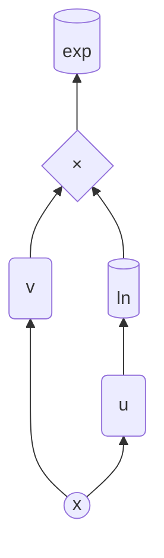

# POW 
Earlier, we calculated $f =$ [a<sup>u(x)</sup>](EXP.md#different-constant-bases) and $f =$ [u(x)<sup>c</sup>](CONST_POW.md#-1) so let's do $u(x)^{v(x)}$.  
Let's consider $f = u^v$, we can write $u^v$ as $e^{v\ln(u)}$  
If we draw the order of operations on that, it will be a tree resembling:

I am going to admit that I did try to find a closed recurrence relation for this function too but i was not really successful and by the pattern I noticed it is going to include nested summations so instead of a $O(n^{3+})$ function, let's do the smart thing and use the functions we already did solve!  
Let's consider $h = \ln(u)$, so we have:
```math
h_n = \frac {u_n - \sum_{k = 1}^{n-1}\binom{n-1}{k-1}u_{n-k}\cdot h_k} {u}
```
By using the formula we derived for [ln](LN.md), and if we consider $g = v\ln(u) \equiv vh$, by lebiniz's formula, we have:
```math
g_n = \sum_{k = 0}^n\binom{n}{k} v_{n-k}h_{k}
```
and finally because we have $f = e^g$ by using our exp [formula](EXP.md), we have:
```math
f_n = \sum_{k = 1}^{n}\binom{n-1}{k-1}f_{n-k} g_k
```

Or if we write a program assuming we have all our different functions already built:
```python
def pow_derivatives(u_list, v_list, order):
    # u_list is the list of all the derivatives of u from order 0..n
    # same with v_list

    lnu_list = ln_derivatives(u_list, order)
    vlnu_list = product_derivatives(v_list, lnu_list, order)
    f_list = exp_derivatives(vlnu_list, order)
    
    return f_list
```
This uses already built functions and it is just us using them as modular bricks to get what we want.  
Let's go right back to [README](README.md) to explore other functions!