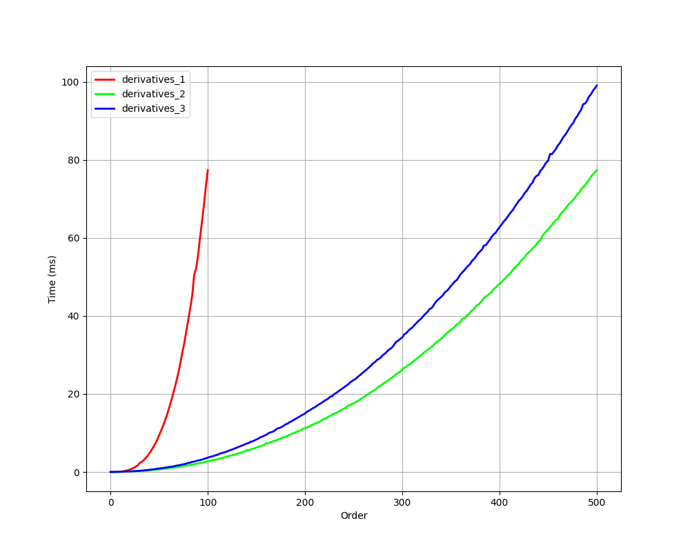
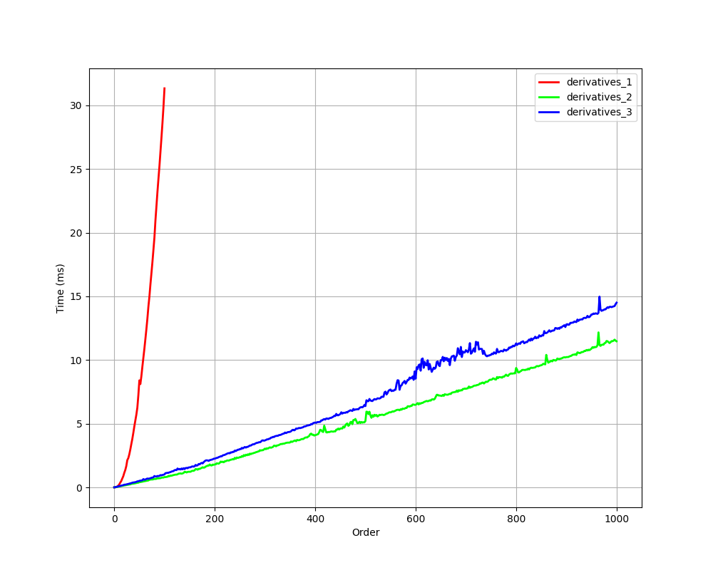
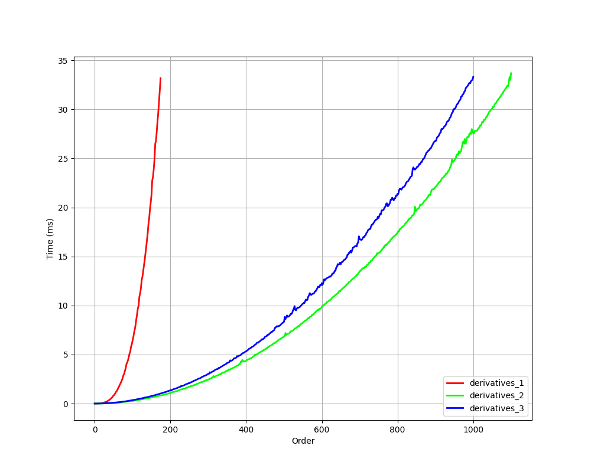
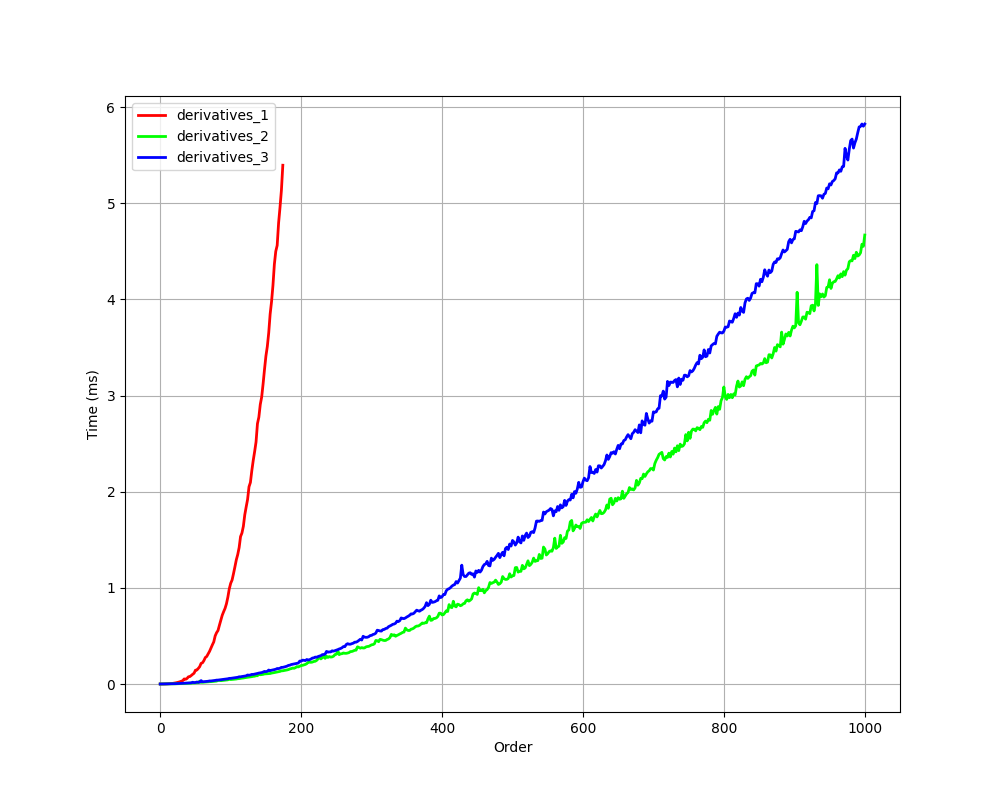

# Sin and Cos

The characters where the story known as trigonometry starts at the simple and delightful, $\sin$ & $\cos$.  

Starting with:
## $\sin(u(x))$
There are plethora of ways we can tackle this problem and we will take a look at various ways.  
#### Derivation 1:  
Let's get right into it, so, we have our function $f(x) = \sin(u(x))$ or 
```math
f = \sin(u)
```
differentiating both sides gives us:
```math
\begin{equation}
f_1 = u_1\cos(u)
\end{equation}
```
squaring both sides will give us:
```math
f_1^2 = u_1^2\cos^2(u)
```
using the pythagorean identity $\sin^2(x) + \cos^2(x) = 1$ we can replace $\cos^2(u)$ with $1 - \sin^2(u)$ in our equation, giving us:
```math
f_1^2 = u_1^2(1-\sin^2(u))
```
and since $f = \sin(u)$, replacing $\sin$ with $f$, we get:
```math
f_1^2 = u_1^2(1-f^2)
```
or
```math
\begin{equation}
f_1^2 = u_1^2-(u_1f)^2
\end{equation}
```

If we apply Leibniz's rule on both sides of the equation $n-1$ times, we get:
```math
\sum_{k=0}^{n-1}\binom{n-1}{k}f_{k+1}f_{n-k}=\sum_{k=0}^{n-1}\binom{n-1}{k}u_{k+1}u_{n-k}-\sum_{k=0}^{n-1}\binom{n-1}{k}\left(\sum_{r=0}^{k}\binom{k}{r}u_{r+1}f_{k-r}\right)\left(\sum_{r=0}^{n-k-1}\binom{n-k-1}{r}u_{r+1}f_{n-k-r-1}\right)
```
That is pure mess, but let's work with it...  
Looking at the LHS, we can see that $f_n$ appears only two times in that summation, the first $k=0$ and the last $k=n-1$ terms, so taking them out of the summation, we get:
```math
2f_{1}f_{n}=\sum_{k=0}^{n-1}\binom{n-1}{k}u_{k+1}u_{n-k}-\sum_{k=0}^{n-1}\binom{n-1}{k}\left(\sum_{r=0}^{k}\binom{k}{r}u_{r+1}f_{k-r}\right)\left(\sum_{r=0}^{n-k-1}\binom{n-k-1}{r}u_{r+1}f_{n-k-r-1}\right)-\sum_{k=1}^{n-2}\binom{n-1}{k}f_{k+1}f_{n-k}
```
To put everything under a single summation, let's pull $k=0$ and $k=n-1$ terms from the other summations too
```math
2f_{1}f_{n}=2u_{1}u_{n}-2u_{1}f\sum_{k=0}^{n-1}\binom{n-1}{k}u_{k+1}f_{n-k-1}+\sum_{k=1}^{n-2}\binom{n-1}{k}u_{k+1}u_{n-k}-\sum_{k=1}^{n-2}\binom{n-1}{k}\left(\sum_{r=0}^{k}\binom{k}{r}u_{r+1}f_{k-r}\right)\left(\sum_{r=0}^{n-k-1}\binom{n-k-1}{r}u_{r+1}f_{n-k-r-1}\right)-\sum_{k=1}^{n-2}\binom{n-1}{k}f_{k+1}f_{n-k}
```
and let's take out the $k=0$ and $k=n-1$ terms from the newly generated summation as well
```math
2f_{1}f_{n}=2u_{1}u_{n}-2u_{1}^{2}ff_{n-1}-2u_{1}u_{n}f^2-2u_{1}f\sum_{k=1}^{n-2}\binom{n-1}{k}u_{k+1}f_{n-k-1}+\sum_{k=1}^{n-2}\binom{n-1}{k}u_{k+1}u_{n-k}-\sum_{k=1}^{n-2}\binom{n-1}{k}\left(\sum_{r=0}^{k}\binom{k}{r}u_{r+1}f_{k-r}\right)\left(\sum_{r=0}^{n-k-1}\binom{n-k-1}{r}u_{r+1}f_{n-k-r-1}\right)-\sum_{k=1}^{n-2}\binom{n-1}{k}f_{k+1}f_{n-k}
```
and now collapse it
```math
2f_{1}f_{n}=2u_{1}u_{n}-2u_{1}^{2}ff_{n-1}-2u_{1}u_{n}f^2+\sum_{k=1}^{n-2}\binom{n-1}{k}\left(u_{k+1}u_{n-k}-f_{k+1}f_{n-k}-2u_{1}fu_{k+1}f_{n-k-1}-\left(\sum_{r=0}^{k}\binom{k}{r}u_{r+1}f_{k-r}\right)\left(\sum_{r=0}^{n-k-1}\binom{n-k-1}{r}u_{r+1}f_{n-k-r-1}\right)\right)
```
simplifying a bit
```math
\begin{align*}
2f_{1}f_{n}&=2u_{1}u_{n}(1-f^2)-2u_{1}^{2}ff_{n-1}+\sum_{k=1}^{n-2}\binom{n-1}{k}\left(u_{k+1}(u_{n-k}-2u_{1}ff_{n-k-1})-f_{k+1}f_{n-k}-\left(\sum_{r=0}^{k}\binom{k}{r}u_{r+1}f_{k-r}\right)\left(\sum_{r=0}^{n-k-1}\binom{n-k-1}{r}u_{r+1}f_{n-k-r-1}\right)\right) \\
f_n&=\frac{u_1}{f_1}\left(u_n(1-f^2)-u_1ff_{n-1}\right)+\frac{1}{2f_1}\sum_{k=1}^{n-2}\binom{n-1}{k}\left(u_{k+1}(u_{n-k}-2u_{1}ff_{n-k-1})-f_{k+1}f_{n-k}-\left(\sum_{r=0}^{k}\binom{k}{r}u_{r+1}f_{k-r}\right)\left(\sum_{r=0}^{n-k-1}\binom{n-k-1}{r}u_{r+1}f_{n-k-r-1}\right)\right) \\
\frac{u_1}{f_1}&=\frac{1}{\cos(u)}\quad(\text{from eq. 1}) \\
f_n&=u_n\cos(u)-u_1f_{n-1}\tan(u)+\frac{1}{2f_1}\sum_{k=1}^{n-2}\binom{n-1}{k}\left(u_{k+1}(u_{n-k}-2u_{1}ff_{n-k-1})-f_{k+1}f_{n-k}-\left(\sum_{r=0}^{k}\binom{k}{r}u_{r+1}f_{k-r}\right)\left(\sum_{r=0}^{n-k-1}\binom{n-k-1}{r}u_{r+1}f_{n-k-r-1}\right)\right) \\
\end{align*}
```
And we have our formula!
```math
f_n=u_n\cos(u)-u_1f_{n-1}\tan(u)+\frac{1}{2f_1}\sum_{k=1}^{n-2}\binom{n-1}{k}\left(u_{k+1}(u_{n-k}-2u_{1}ff_{n-k-1})-f_{k+1}f_{n-k}-\left(\sum_{r=0}^{k}\binom{k}{r}u_{r+1}f_{k-r}\right)\left(\sum_{r=0}^{n-k-1}\binom{n-k-1}{r}u_{r+1}f_{n-k-r-1}\right)\right)
```
Implemented it might look like:
```python
def sin_derivatives(u_list, order):
    # u_list contains all derivatives of sin(u) from order 0..n at some point x

    f_list = [0.0] * (order + 1) # reserving space for all the derivatives of f
    f_list[0] = math.sin(u_list[0])
    cosu = math.cos(u_list[0])
    tanu = math.tan(u_list[0])

    if order > 0:
        f_list[1] = u_list[1] * cosu

    # outer loop to calculate all the derivatives of f
    for n in range(2, order + 1):
        f_list[n] += u_list[n] * cosu - u_list[1] * f_list[n-1] * tanu

        sum = 0.0
        # inner loop for calculation of each f{m}
        for k in range(1, n - 1):

            inner_sum_1 = 0.0
            for r in range(k + 1):
                inner_sum_1 += nCr(k, r) * u_list[r + 1] * f_list[k-r]

            inner_sum_2 = 0.0
            for r in range(n - k):
                inner_sum_2 += nCr(n-k-1, r) * u_list[r + 1] * f_list[n-k-r-1]
            
            sum += u_list[k+1]*(u_list[n-k]-2*u_list[1]*f_list[0]*f_list[n-k-1])
            sum -= f_list[k+1]*f_list[n-k]
            sum -= inner_sum_1 * inner_sum_2
        
        f_list[n] -= sum / (2 * f_list[1])
    
    return f_list
```
#### Derivation 2:
But if you consider $u_1f$ to be a new function say $h$ then if you look at the formula we are recalculating $h_m$ repeatedly, so let's use $h$ instead of $u_1f$ in equation $(2)$, we have:
```math
f_1^2=u_1^2-h^2
```
Differentiating this we get:
```math
\sum_{k=0}^{n-1}\binom{n-1}{k}f_{k+1}f_{n-k}=\sum_{k=0}^{n-1}\binom{n-1}{k}u_{k+1}u_{n-k}-\sum^{n-1}_{k=0}\binom{n-1}{k}h_kh_{n-k-1}
```
applying same steps as earlier:
```math
2f_1f_n = 2u_1u_n - 2hh_{n-1} + \sum_{k=1}^{n-2}\binom{n-1}k\left(u_{k+1}u_{n-k}-h_kh_{n-k-1}-f_{k+1}f_{n-k}\right)
```
segregating the $f_n$ term, we have our formula:
```math
f_n=\frac{u_n}{\cos(u)}-h_{n-1}\tan(u)+\frac{1}{2f_1}\sum_{k=1}^{n-2}\binom{n-1}k\left(u_{k+1}u_{n-k}-h_kh_{n-k-1}-f_{k+1}f_{n-k}\right)
```
Where,
```math
h_m = \sum_{k=0}^m\binom mk u_{k+1}f_{m-k}
```
Implementing it we get:
```python
def sin_derivatives(u_list, order):
    # u_list contains all the derivatives of u from order 0..n at some point x

    f_list = [0.0] * (order+1) # reserving space for all the derivatives of f
    f_list[0] = math.sin(u_list[0])

    if order == 0:
        return f_list
    
    cosu = math.cos(u_list[0])
    tanu = math.tan(u_list[0])

    f_list[1] = u_list[1] * cosu
    # it can also be calculated using the same general formula but I refrained from
    # putting it in the loop as it will require an if case to not divide by f_list[1] i.e, itself
    
    h_list = [0.0] * (order) # since each further derivation require h{n-1} <=> u1f{n-1}

    for n in range(2, order + 1):

        # calculation of (u_1f){n-1}
        for k in range(n):
            h_list[n-1] += nCr(n-1, k) * u_list[k + 1] * f_list[n - 1 - k]

        sum = 0.0
        for k in range(1, n-1):
            sum += nCr(n-1, k) * (u_list[k+1] * u_list[n-k] - h_list[k] * h_list[n-k-1] - f_list[k+1] * f_list[n-k])
        sum /= 2 * f_list[1]
        
        f_list[n] = u_list[n] / cosu - h_list[n-1] * tanu + sum
    
    return f_list
```
#### Derivation 3:
If we look again at the original equation $(2)$, it can also be written as:
```math
f_1^2 = u_1^2 - u_1^2f^2
```
We can see that $u_1^2$ appears in both the terms on the RHS, and we already know all of our $u_n$'s so we can take a new function $h = u_1^2$ and take $v = f^2$, we have:
```math
f_1^2 = h-hv
```
Applying the same steps as the above derivation, we have
```math
2f_1f_n=h_{n-1}(1-v)-hv_{n-1}-\sum_{k=1}^{n-2}\binom{n-1}{k}\left(h_kv_{n-k-1} + f_{k+1}f_{n-k}\right)
```
Simplifying which we get our formula:
```math
f_n = \frac {h_{n-1}(1-v)-hv_{n-1}-\sum_{k=1}^{n-2}\binom{n-1}{k}\left(h_kv_{n-k-1} + f_{k+1}f_{n-k}\right)} {2f_1}
```
where:
```math
\begin{align*}
h_m &= \sum_{k=0}^{m}\binom mk u_{k+1}u_{m-k+1} \\
v_m &= \sum_{k=0}^m\binom mk f_kf_{m-k}
\end{align*}
```
Implemention:
```python
def sin_derivatives(u_list, order):
    # u_list contains all the derivatives of u from order 0..n at some point x

    f_list = [0.0] * (order + 1) # reserving space for all the derivatives of f
    f_list[0] = math.sin(u_list[0])

    if order == 0:
        return f_list
    
    f_list[1] = u_list[1] * math.cos(u_list[0])

    u1_list = u_list[1:]
    h_list = product_derivatives(u1_list, u1_list, order - 1)

    v_list = [0.0] * (order)
    v_list[0] = f_list[0] * f_list[0]

    for n in range(2, order + 1):
        v_list[n-1] = product_derivative(f_list, f_list, n-1)

        for k in range(1, n-1):
            f_list[n] -= nCr(n-1, k) * (h_list[k] * v_list[n-k-1] + f_list[k+1] * f_list[n-k])
        f_list[n] += h_list[n-1] * (1 - v_list[0]) - h_list[0] * v_list[n-1]
        f_list[n] /= 2 * f_list[1]
    
    return f_list
```
Here we can see that the first implementation is $O(n^3)$ while the second and third implementations are both $O(n^2)$ so how do we decide what implementation to choose from??  
Well we can see that first implementation is $O(n^3)$ so it has to be the slowest, the loop structure of the third function is cleaner but it also has to manage two extra variables while the second only has to manage one so it must be the second implementation that is the fastest!!  
Well as everything in production, we can't judge them based off what looks like, we should benchmark them to know for sure!  
Here are some results:  
python, pure(1) and utilizing numpy(2):  
   

c++, no optimizations-O0(1) and optimizations enabled-O2(2):  
 
Benchmark code will be available [here](benchmark/).  

We can see a clear pattern in all of them regardless of the language and optimization, `derivatives_1` is the slowest as it operates in $O(n^3)$ time complexity, `derivatives_3` comes in at the second position having a time complexity of $O(n^2)$ despite being the cleanest, it comes short of being first with the first place held by `derivatives_2` with a time complexity of $O(n^2)$ and having to manage only a single extra unlike managing 2 in derivatives_3.

Since they have a similar shape in all of the benchmarks, we can conclude using the results of c++(-O2) version at the $\text{order}=1000$ that derivatives_3 and derivatives_2 have times of $5.823360\text{ms}$ & $4.668880\text{ms}$ per function call respectively, making **derivatives_2 roughly $25$ % faster than derivatives_3** .

One interesting thing to note here is that, in the numpy version, derivatives_2 and derivatives_3 don't show quadratic nature but rather a linear one.