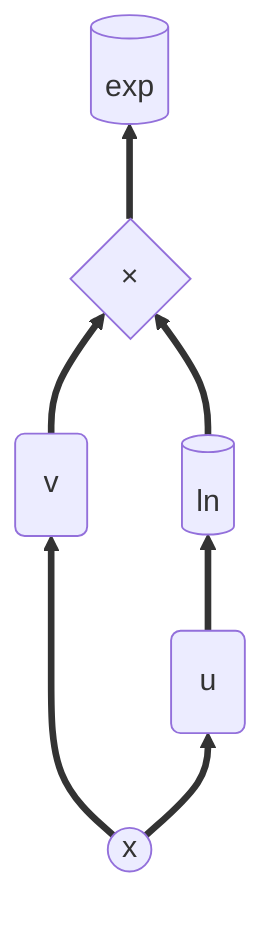

# General Power Functions
Earlier, we calculated $f = a^{u(x)}$ and $f = u(x)^c$.  
So let's do $u(x)^{v(x)}$.  

### Function Architecture
Let's consider $f = u^v$, we can write $u^v$ as $e^{v\ln(u)}$  
If we draw the order of operations on this function, it will resemble a tree:

So, if we consider $g=\ln(u)$ and $h=vg$, we have $f = e^h$, and by using the formula for $e^u$ $\rightarrow$ **refer:** [`exponential.md`](exponential.md).  
We will have our:
### Formula
```math
f_n = \sum_{k = 0}^{n - 1}\binom{n-1}{k}f_{k}h_{n-k}
```
Where:
```math
h_n = \sum_{k = 0}^n\binom{n}{k} v_{n-k} g_{k}
```
using Leibniz's rule $\rightarrow$ **refer:** [`product.md`](..\product.md)  
And:
```math
\begin{align*}
g_n &= \frac {u_n - \sum_{k = 1}^{n-1}\binom{n-1}{k-1}u_{n-k}g_k} {u} : n \ge 1 \\
g &= \ln(u) \\
\end{align*}
```
Using the formula we derived for logarithm $\rightarrow$ **refer:** [`logarithm.md`](..\logarithm.md)  

### Practical Implementation
```python
def general_pow_derivatives(u_list, v_list, order):
    # u_list is the list of all the derivatives of u from order 0..n
    # same with v_list

    lnu_list = ln_derivatives(u_list, order)
    vlnu_list = product_derivatives(v_list, lnu_list, order)
    f_list = exp_derivatives(vlnu_list, order)
    
    return f_list
```
This uses the functions we already built and we can use them as building blocks for this case.